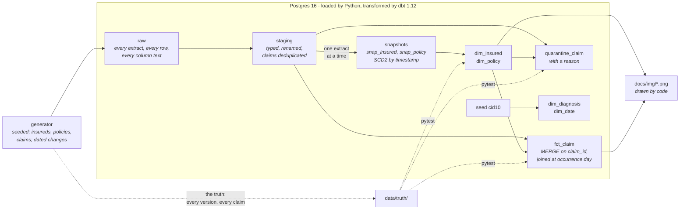

# Estrato

### Every layer stays where it was laid.

Health-insurance claims rebuilt as a dimensional model with Type 2 history:
dbt snapshots on Postgres, a synthetic source that changes over time, and a
test suite that holds the warehouse to the truth the source was cut from.

<p>
  <a href="https://github.com/kabianca/estrato-claims-warehouse/actions/workflows/tests.yml">
    
  </a>
  
  
  
  
</p>

**English** · [Português](README.pt-BR.md)

## Why I rebuilt this

This repository started as the sixth project of a data-analysis
certification: one Colab notebook over a CSV of 591,539 health-insurance
claims, asking whether a prevention programme for diabetes and hypertension
was paying off. That notebook is still here, untouched, in
[`legacy/`](legacy/), because of one cell in it.

The CSV was flat: every claim row carried the insured's attributes. When the
notebook tried to build a table of insured persons, it found that some of
them appeared several times with different attributes, and it explained why:

> O assegurado tem 4 registros, em um registro a idade não tem valor, o
> ind_capital_provincia mostra que o assegurado mudou de Província para
> capital (Lisboa). **A solução da empresa é manter somente o último
> registro** [...]

```python
dfSaude_populacao = dfSaude_populacao.drop_duplicates(subset=['num_afiliado'], keep='last')
```

The insured had moved. The company's answer was to keep the last record. From
that line on, every claim that person ever made is reported under the
address they have now, and nothing in the notebook can tell: no error is
raised, the numbers come out, and they are wrong in a way that grows with
every year of history.

So the thesis here is that **history is a modelling decision, not a side
effect.** When an attribute changes, the warehouse either overwrites it or
keeps both versions with the dates they were true, and that choice must be
made on purpose, written down and tested. This is Slowly Changing Dimension
Type 2, built the way it is built in practice: dbt snapshots, replayed
extract by extract, against a source designed to change.

The companion repositories argue two other properties of the same
discipline: [Maré](https://github.com/kabianca/bcb-airflow-pipeline) is
*correct under replay* for ingestion with Airflow, and
[Âncora](https://github.com/kabianca/cohort-rfm-ecommerce) is *deterministic
under re-run* for transformation with Spark. This one is *right about the
past*, and deliberately has no orchestrator and no streaming: a portfolio is
judged on coverage, not repetition.

---

## Architecture



The generator writes what a source system would send: a full extract of the
insured and policy tables at the end of every month, and one file of claims
per month of reception. The replay feeds the extracts to the snapshots one
date at a time, in order, and builds the marts after each, the way a monthly
schedule would have. The generator also writes what no warehouse gets to
see, the truth, and the test suite holds the marts to it row by row.

---

## Design decisions

### A change is a new row, dated by the source

`snap_insured` and `snap_policy` use dbt's `timestamp` strategy on the
source's `updated_at`. A version starts when the source says the row changed,
not when the warehouse noticed. Each version gets a surrogate key that is a
hash of the business key and that timestamp, so a rebuild produces the same
keys, which an integer sequence would not promise. The dimensions expose the
history as `valid_from`, `valid_to`, `is_current`.

```text
 insured_id | valid_from |  valid_to  | marital_status | region | is_current
------------+------------+------------+----------------+--------+------------
      10007 | 2012-09-30 | 2017-07-03 | S              | L      | f
      10007 | 2017-07-03 |            | S              | N      | t
```

### A claim points at the version in force on the day it happened

`fct_claim` joins each claim to the insured and policy versions whose
`[valid_from, valid_to)` covers `occurrence_date`, and stores the version's
surrogate key. The attributes stay in the dimension; "what did this person
look like at the time" and "what do they look like now" are the same join
with a different filter. Insured 10007 above moved on 3 July 2017; claim
42766 happened on 28 June and only arrived on 28 July, after the move, and
it still reads `L`:

```text
 claim_id | occurrence_date | reception_date | region_at_the_time | region_today
----------+-----------------+----------------+--------------------+--------------
    37585 | 2017-04-15      | 2017-04-27     | L                  | N
    42766 | 2017-06-28      | 2017-07-28     | L                  | N
    58540 | 2017-12-08      | 2017-12-08     | N                  | N
```

A day is the grain of that attribution. Claims carry a date, not an instant,
so a change stamped anywhere on day *d* counts for the whole of day *d*, and
a claim on the day an insured joined belongs to their first version, not to
quarantine. The generator applies the same rule when it writes the truth.

### A snapshot is a one-way street

A snapshot answers "what does the source say now". Feed it an extract older
than the last one it saw and a key cancelled in March is present again in
January, and dbt, correctly, brings it back to life with a version that
overlaps the ones it already has. So the replay keeps `meta.replay_log`,
resumes from the first extract not yet seen, refuses to go backwards with a
message that says why, and offers `--rebuild` for when starting over is the
intent. Reloading `raw` drops everything dbt built from the previous `raw`.

### A cancellation is a row, not an absence

When a key stops appearing in the extracts, `hard_deletes: new_record`
closes its last version and opens a deleted marker carrying the last
attributes seen. A claim dated after that lands in quarantine as
`insured_cancelled`, not on a version that was no longer true. dbt stamps
that marker with the wall clock, which in a replay is years late, so
[`snapshot_get_time`](dbt/macros/snapshot_get_time.sql) is overridden to
return the first instant after the extract being replayed.

### Nothing vanishes: quarantine has a reason

Every staged claim received by `as_of` is in the fact or in
`quarantine_claim`, never both, never neither, and a singular test says so.
Quarantine rows keep every column and add why: `unknown_insured`,
`no_version_at_occurrence`, `insured_cancelled`. The generator injects each
of these on purpose and the suite checks that each reason was found exactly
as often as it was planted.

### The fact is merged at the grain of the claim

`fct_claim` is incremental with `claim_id` as the merge key. Each replay
step processes the reception month of `as_of`; a month run twice lands twice
on the same rows. Late claims (a fifth of them arrive in a later month than
they happened) enter with their reception month and are attributed by their
occurrence date. Rows the source sent twice are kept in `raw` and dropped in
staging, first arrival wins.

### Age is a measure, not an attribute

The legacy CSV carried `edad` on every claim row, and it drifted with the
extract. Here the insured has a birth date and the fact has
`age_at_occurrence`, computed from the claim's own date. A claim from 2016
is not reported at a 2018 age.

### The source is synthetic, and it knows the truth

Public claims datasets almost never carry what a Type 2 dimension needs:
attributes that change on known dates. So [`generate.py`](estrato/generate.py)
plays the source system, month by month: people join, cancel, marry, move,
change plan, enrol; claims happen, arrive late, get sent twice, point at
people who do not exist. Next to the extracts it writes the truth, every
version with the instant it started, and the same seed writes the same bytes.

### What a monthly snapshot cannot see

An extract at the end of a month sees at most one state per key: a key
that changes twice in a month loses a version, and a cancellation is dated
at the extract that no longer lists the key, not at the day it happened.
The generator changes each key at most once a month by construction, so the
tests are fair. The honest fix is change data capture, not a cleverer
snapshot.

---

## Running it

Docker is the only requirement. Postgres and the image start on demand.

```bash
make build         # dbt-core 1.12, dbt-postgres 1.11, numpy, matplotlib, in one image
make run           # generate → load → replay: 37 extracts, ~2 minutes, then dbt test
make fingerprint   # row count and content hash of every mart
```

`make run` writes the synthetic source into `data/` (never committed), loads
it into `raw`, replays the 37 extracts through the snapshots and the marts,
and runs the dbt tests. `SEED=7 SCALE=2000 make generate` changes the source.

### Proving it in a minute

```bash
make fingerprint                  # keep the six lines
make step AS_OF=2018-12-31        # snapshot the latest extract again
make fingerprint                  # same six lines
make step AS_OF=2018-06-30        # refused: the snapshot has moved on
REBUILD=1 make replay             # drop what dbt built and replay from scratch
make fingerprint                  # same six lines, surrogate keys included
```

### Looking at the results

```bash
make psql
```

```sql
-- one insured's claims, read two ways
select f.claim_id, f.occurrence_date, at_the_time.region, today.region
from marts.fct_claim f
join marts.dim_insured at_the_time on at_the_time.insured_sk = f.insured_sk
join marts.dim_insured today on today.insured_id = at_the_time.insured_id and today.is_current
where at_the_time.insured_id = 10007 order by 2;

-- what could not be placed, and why
select reason, count(*) from marts.quarantine_claim group by 1;
```

`make dbt ARGS="test --select dim_insured"` runs any dbt command inside the
image; `make dbt ARGS="build --vars '{as_of: 2017-03-31}'"` builds the
warehouse as it stood after March 2017, if the replay has not gone past it.

---

## Figures

Both figures ask the finished warehouse the same question: how different
would the numbers be if every claim were reported under the insured's
*current* attributes, which is what "keep the last record" does? Both
answers are in the dimensions, one join apart, so the comparison is a query.


Of the claims that happened in 2016, 12.5 % would be counted with the wrong
programme membership, 10.6 % with the wrong marital status and 5.5 % in the
wrong region. The older the claim, the larger the share: overwrite errors
do not average out, they accumulate.


The notebook's own question, programme claims per month, read both ways.
Counting with today's membership makes the programme look 40 % bigger in
its first months than it was, because everyone who enrolled later is
counted as if they had always been in. The last month dips because claims
that arrived in January 2019 are past the horizon: in a warehouse fed by
reception date, the latest month is always incomplete.

`make charts` redraws both from the marts.

---

## Layout

```text
estrato/            generate.py (the source and its truth), load.py, replay.py,
                    fingerprint.py, charts.py, catalog.py
dbt/                models/staging, snapshots/, models/marts, macros/ (as_of,
                    snapshot_get_time, the two SCD2 generic tests), tests/, seeds/
tests/              pytest: generator, stack, integration against the truth
legacy/             the original notebook, untouched
docs/img/           figures, drawn by `make charts`
```

Four flat schemas in Postgres: `raw` (the loader's), `staging`, `snapshots`
and `marts` (dbt's), plus `meta.replay_log`.

---

## Tests

`make test` runs 26 pytest tests inside the image, in a database of their
own; `dbt test` runs 60 more at the end of every replay. Together:

| Claim | Where |
|---|---|
| A 2016 claim is attributed to the attributes in force in 2016, not today's | `assert_claim_attributed_to_version_in_force.sql`; `test_every_claim_is_attributed_as_the_truth_says` |
| A change closes the previous version and opens the next, no gap, no overlap | `scd2_contiguous` on both dimensions |
| Exactly one current version per business key | `one_current_per_key` on both dimensions |
| Re-running a step does not create a duplicate version; a rebuild gives the same bytes | `test_rerunning_the_latest_step_changes_nothing`, `test_rebuilding_from_scratch_gives_the_same_bytes` |
| One row per claim, no duplication on reprocessing | `unique` on `claim_id`; `test_remerging_one_month_of_the_fact_changes_nothing` |
| Surrogate keys are never reused | `unique` on the keys, and the fingerprint surviving a rebuild |
| An orphan claim goes to quarantine with a reason, never vanishes | `assert_fact_and_quarantine_partition_the_claims.sql`; `test_quarantine_reasons_match_truth` |
| The dimensions equal the truth the extracts were cut from | `test_insured_dimension_matches_truth`, `test_policy_dimension_matches_truth` |
| The replay refuses to go backwards | `test_replay_refuses_to_go_backwards` |
| Same seed, same bytes; every version observable; every defect present | `tests/test_generate.py` |

[`tests.yml`](.github/workflows/tests.yml) builds the image, starts the same
Postgres the compose file does, and runs `make lint` and `make test`. The
badge asserts what a clone gets.

---

## What running it taught me

**Replaying history twice is not idempotent, and it should not be.** I
expected a second full replay to converge like a second `dbt run` does. It
failed on the second extract with `MERGE command cannot affect row a second
time`: keys cancelled in 2016 had been resurrected by the 2015 extract. The
snapshot was right; my mental model was wrong. What converges is re-running
the latest step, and rebuilding from scratch. The replay log and the guard
came out of that afternoon.

**A staging view that filters on a variable is stale by the next step.** The
first version filtered `extract_date = as_of` in `stg_insured`. The view was
compiled under one replay step and read, unchanged, by the snapshot of the
next. The filter moved into the snapshot itself, where it is rendered at the
moment the snapshot runs.

**The boundary matters more than the rule.** Comparing instants put a claim
made on the day an insured joined into quarantine: the claim was at 00:00,
the record was created at 10:14. The truth test failed on three rows out of
five thousand. A day is the grain, on both sides.

**dbt's deleted marker copies the last attributes seen.** I had assumed it
would be a row of nulls. Reading the snapshot materialisation before
writing the truth writer saved a wrong test.

---

## Where this grows

- **Change data capture.** The monthly extract is the ceiling on what the
  history can know; a CDC feed would see every change, and the snapshot
  would give way to a merge over the change log.
- **Late-arriving dimensions.** A claim quarantined as `unknown_insured`
  today may be attributable tomorrow; the next step is a retry from
  quarantine on each replay.
- **Type 1 attributes inside a Type 2 dimension.** A correction to a birth
  date should overwrite every version, not open a new one; dbt snapshots do
  not do that on their own.
- **Orchestration** is [Maré](https://github.com/kabianca/bcb-airflow-pipeline)'s
  argument; here `make replay` is the scheduler, on purpose.

---

## What I would do differently in production

- The extracts would be pulled from the source, and their arrival would be
  the event that triggers a replay step, with `as_of` coming from the
  orchestrator's run interval and the guard against going backwards failing
  the DAG.
- `raw` would be partitioned by extract date and kept in object storage,
  with Postgres holding only the snapshots and the marts.
- The fact would also carry the current version's key, precomputed, because
  "as it looks today" is asked more often than the join deserves repeating.

---

## Data

Synthetic, by design. `make generate` writes 10,000 insured persons, three
years of monthly extracts (plus an initial load dated 2015-12-31), about
93,000 claims, and the truth next to them; `data/truth/report.json` records
how many of each event and defect were planted. The legacy notebook's CSV
was the certification's and is not in the repository; the generator imitates
its spellings (`num_afiliado`, `fec_ocurrencia`, `I10X`) so that the two
halves of the repository describe the same world.
