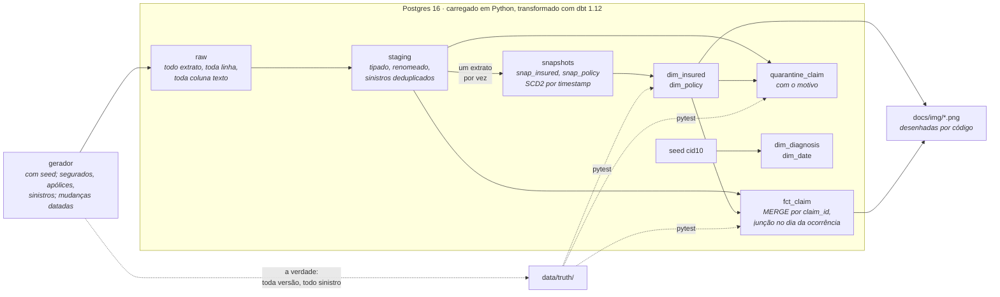
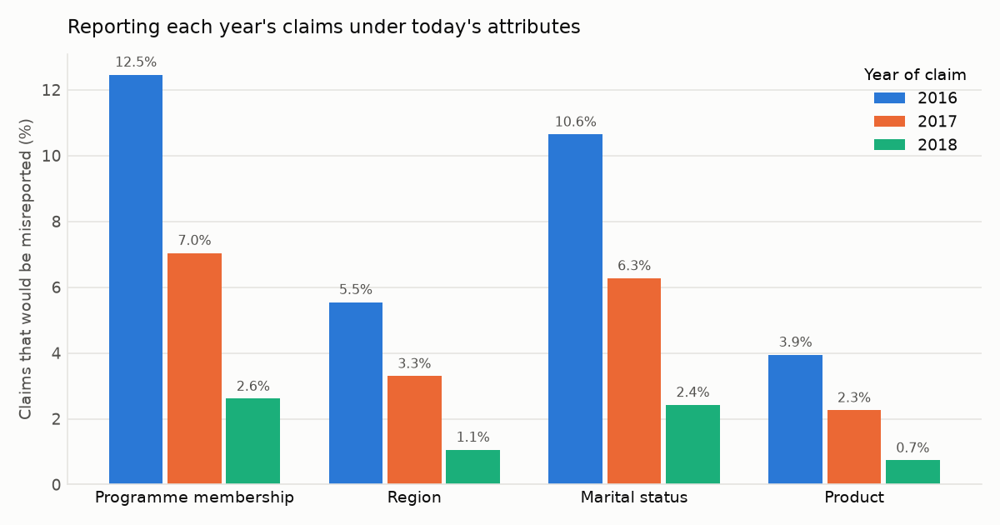
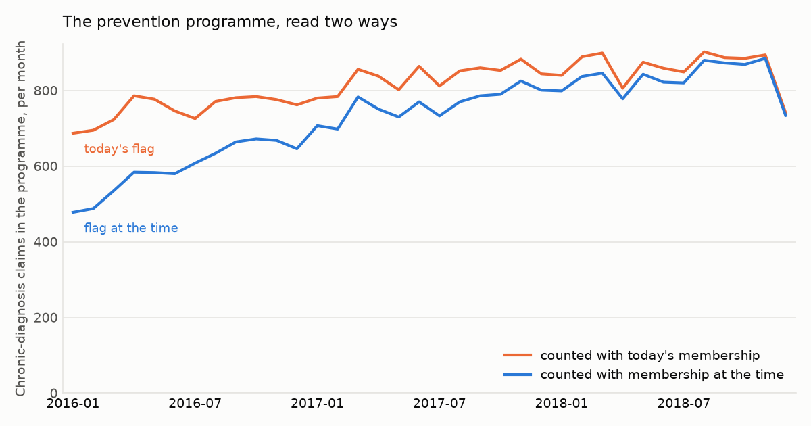

# Estrato

### Cada camada fica onde foi depositada.

Sinistros de seguro-saúde reconstruídos como um modelo dimensional com
histórico Tipo 2: snapshots do dbt sobre Postgres, uma fonte sintética que
muda ao longo do tempo e uma suíte de testes que cobra do warehouse a
verdade de onde a fonte foi recortada.

<p>
  <a href="https://github.com/kabianca/estrato-claims-warehouse/actions/workflows/tests.yml">
    
  </a>
  
  
  
  
</p>

[English](README.md) · **Português**

## Por que eu reconstruí isso

Este repositório começou como o sexto projeto de uma certificação em análise
de dados: um notebook no Colab sobre um CSV de 591.539 sinistros de
seguro-saúde, perguntando se um programa de prevenção de diabetes e
hipertensão estava valendo a pena. Esse notebook continua aqui, intocado,
em [`legacy/`](legacy/), por causa de uma célula dele.

O CSV era plano: cada linha de sinistro carregava os atributos do segurado.
Quando o notebook tentou montar uma tabela de segurados, descobriu que
alguns apareciam várias vezes com atributos diferentes, e explicou por quê:

> O assegurado tem 4 registros, em um registro a idade não tem valor, o
> ind_capital_provincia mostra que o assegurado mudou de Província para
> capital (Lisboa). **A solução da empresa é manter somente o último
> registro** [...]

```python
dfSaude_populacao = dfSaude_populacao.drop_duplicates(subset=['num_afiliado'], keep='last')
```

O segurado tinha se mudado. A resposta da empresa foi manter o último
registro. Daquela linha em diante, todo sinistro que essa pessoa já fez
passa a ser reportado sob o endereço que ela tem agora, e nada no notebook
consegue perceber: nenhum erro é levantado, os números saem, e estão errados
de um jeito que cresce a cada ano de histórico.

A tese aqui, portanto, é que **histórico é decisão de modelagem, não efeito
colateral.** Quando um atributo muda, o warehouse ou o sobrescreve ou guarda
as duas versões com as datas em que foram verdadeiras, e essa escolha precisa
ser feita de propósito, escrita e testada. Isso é Slowly Changing Dimension
Tipo 2, construído do jeito que se constrói na prática: snapshots do dbt,
reproduzidos extrato a extrato, contra uma fonte desenhada para mudar.

Os repositórios companheiros defendem outras duas propriedades da mesma
disciplina: o [Maré](https://github.com/kabianca/bcb-airflow-pipeline) é
*correto sob replay* para ingestão com Airflow, e o
[Âncora](https://github.com/kabianca/cohort-rfm-ecommerce) é *determinístico
sob reexecução* para transformação com Spark. Este é *correto sobre o
passado*, e deliberadamente não tem orquestrador nem streaming: um portfólio
é julgado por cobertura, não por repetição.

---

## Arquitetura



O gerador escreve o que um sistema-fonte enviaria: um extrato completo das
tabelas de segurados e apólices ao fim de cada mês, e um arquivo de sinistros
por mês de recepção. O replay alimenta os snapshots com os extratos uma data
por vez, em ordem, e constrói os marts depois de cada um, como um
agendamento mensal teria feito. O gerador escreve também o que nenhum
warehouse chega a ver, a verdade, e a suíte de testes cobra dela os marts,
linha a linha.

---

## Decisões de design

### Uma mudança é uma linha nova, datada pela fonte

`snap_insured` e `snap_policy` usam a estratégia `timestamp` do dbt sobre o
`updated_at` da fonte. Uma versão começa quando a fonte diz que a linha mudou,
não quando o warehouse percebeu. Cada versão recebe uma chave substituta que
é um hash da chave de negócio e desse timestamp, de modo que uma reconstrução
produz as mesmas chaves, o que uma sequência inteira não prometeria. As
dimensões expõem o histórico como `valid_from`, `valid_to`, `is_current`.

```text
 insured_id | valid_from |  valid_to  | marital_status | region | is_current
------------+------------+------------+----------------+--------+------------
      10007 | 2012-09-30 | 2017-07-03 | S              | L      | f
      10007 | 2017-07-03 |            | S              | N      | t
```

### Um sinistro aponta para a versão vigente no dia em que aconteceu

`fct_claim` junta cada sinistro às versões de segurado e apólice cujo
`[valid_from, valid_to)` cobre `occurrence_date`, e guarda a chave substituta
da versão. Os atributos ficam na dimensão; "como essa pessoa era na época" e
"como ela é agora" são a mesma junção com um filtro diferente. O segurado
10007 acima se mudou em 3 de julho de 2017; o sinistro 42766 aconteceu em 28
de junho e só chegou em 28 de julho, depois da mudança, e mesmo assim lê `L`:

```text
 claim_id | occurrence_date | reception_date | region_at_the_time | region_today
----------+-----------------+----------------+--------------------+--------------
    37585 | 2017-04-15      | 2017-04-27     | L                  | N
    42766 | 2017-06-28      | 2017-07-28     | L                  | N
    58540 | 2017-12-08      | 2017-12-08     | N                  | N
```

O dia é o grão dessa atribuição. Sinistros carregam uma data, não um
instante, então uma mudança registrada em qualquer hora do dia *d* vale para
o dia *d* inteiro, e um sinistro no dia em que o segurado entrou pertence à
sua primeira versão, não à quarentena. O gerador aplica a mesma regra ao
escrever a verdade.

### Snapshot é rua de mão única

Um snapshot responde "o que a fonte diz agora". Alimente-o com um extrato
mais antigo que o último que ele viu e uma chave cancelada em março está
presente de novo em janeiro, e o dbt, corretamente, a traz de volta à vida
com uma versão que se sobrepõe às que ele já tem. Por isso o replay mantém
`meta.replay_log`, retoma do primeiro extrato ainda não visto, recusa-se a
voltar no tempo com uma mensagem que diz o motivo, e oferece `--rebuild`
para quando recomeçar é a intenção. Recarregar `raw` derruba tudo o que o
dbt construiu a partir do `raw` anterior.

### Um cancelamento é uma linha, não uma ausência

Quando uma chave para de aparecer nos extratos, `hard_deletes: new_record`
fecha sua última versão e abre um marcador de exclusão carregando os últimos
atributos vistos. Um sinistro datado depois disso cai na quarentena como
`insured_cancelled`, não numa versão que já não era verdadeira. O dbt carimba
esse marcador com o relógio da máquina, que num replay está anos atrasado,
então [`snapshot_get_time`](dbt/macros/snapshot_get_time.sql) é sobrescrita
para devolver o primeiro instante depois do extrato sendo reproduzido.

### Nada some: a quarentena tem motivo

Todo sinistro em staging recebido até `as_of` está no fato ou em
`quarantine_claim`, nunca nos dois, nunca em nenhum, e um teste singular diz
isso. As linhas de quarentena mantêm todas as colunas e acrescentam o porquê:
`unknown_insured`, `no_version_at_occurrence`, `insured_cancelled`. O gerador
injeta cada um desses de propósito e a suíte verifica que cada motivo foi
encontrado exatamente tantas vezes quantas foi plantado.

### O fato é mesclado no grão do sinistro

`fct_claim` é incremental com `claim_id` como chave de merge. Cada passo do
replay processa o mês de recepção de `as_of`; um mês rodado duas vezes cai
duas vezes nas mesmas linhas. Sinistros atrasados (um quinto deles chega num
mês posterior ao da ocorrência) entram com seu mês de recepção e são
atribuídos pela data de ocorrência. Linhas que a fonte enviou duas vezes
ficam em `raw` e caem no staging: a primeira chegada vence.

### Idade é medida, não atributo

O CSV legado carregava `edad` em toda linha de sinistro, e ela derivava com o
extrato. Aqui o segurado tem data de nascimento e o fato tem
`age_at_occurrence`, calculada a partir da própria data do sinistro. Um
sinistro de 2016 não é reportado com a idade de 2018.

### A fonte é sintética e conhece a verdade

Bases públicas de sinistros quase nunca trazem o que uma dimensão Tipo 2
precisa: atributos que mudam em datas conhecidas. Então o
[`generate.py`](estrato/generate.py) faz o papel do sistema-fonte, mês a mês:
pessoas entram, cancelam, casam, se mudam, trocam de plano, aderem;
sinistros acontecem, chegam atrasados, são enviados duas vezes, apontam para
pessoas que não existem. Ao lado dos extratos ele escreve a verdade, toda
versão com o instante em que começou, e a mesma seed escreve os mesmos bytes.

### O que um snapshot mensal não consegue ver

Um extrato ao fim do mês vê no máximo um estado por chave: uma chave que
muda duas vezes no mês perde uma versão, e um cancelamento é datado no
extrato que deixou de listar a chave, não no dia em que aconteceu. O gerador
muda cada chave no máximo uma vez por mês, por construção, para que os
testes sejam justos. A solução honesta é change data capture, não um
snapshot mais esperto.

---

## Rodando

Docker é o único requisito. O Postgres e a imagem sobem sob demanda.

```bash
make build         # dbt-core 1.12, dbt-postgres 1.11, numpy, matplotlib, numa imagem
make run           # generate → load → replay: 37 extratos, ~2 minutos, depois dbt test
make fingerprint   # contagem de linhas e hash de conteúdo de cada mart
```

`make run` escreve a fonte sintética em `data/` (nunca versionada), carrega
em `raw`, reproduz os 37 extratos pelos snapshots e pelos marts, e roda os
testes do dbt. `SEED=7 SCALE=2000 make generate` muda a fonte.

### Provando em um minuto

```bash
make fingerprint                  # guarde as seis linhas
make step AS_OF=2018-12-31        # snapshot do último extrato de novo
make fingerprint                  # as mesmas seis linhas
make step AS_OF=2018-06-30        # recusado: o snapshot já passou disso
REBUILD=1 make replay             # derruba o que o dbt construiu e reproduz do zero
make fingerprint                  # as mesmas seis linhas, chaves substitutas incluídas
```

### Olhando os resultados

```bash
make psql
```

```sql
-- os sinistros de um segurado, lidos de dois jeitos
select f.claim_id, f.occurrence_date, at_the_time.region, today.region
from marts.fct_claim f
join marts.dim_insured at_the_time on at_the_time.insured_sk = f.insured_sk
join marts.dim_insured today on today.insured_id = at_the_time.insured_id and today.is_current
where at_the_time.insured_id = 10007 order by 2;

-- o que não pôde ser posicionado, e por quê
select reason, count(*) from marts.quarantine_claim group by 1;
```

`make dbt ARGS="test --select dim_insured"` roda qualquer comando do dbt
dentro da imagem; `make dbt ARGS="build --vars '{as_of: 2017-03-31}'"`
constrói o warehouse como estava depois de março de 2017, se o replay ainda
não passou dali.

---

## Figuras

As duas figuras fazem ao warehouse pronto a mesma pergunta: quão diferentes
seriam os números se todo sinistro fosse reportado sob os atributos *atuais*
do segurado, que é o que "manter o último registro" faz? As duas respostas
estão nas dimensões, a uma junção de distância, então a comparação é uma
consulta.



Dos sinistros que aconteceram em 2016, 12,5 % seriam contados com a adesão
ao programa errada, 10,6 % com o estado civil errado e 5,5 % na região
errada. Quanto mais antigo o sinistro, maior a parcela: erros de sobrescrita
não se diluem, acumulam.



A pergunta do próprio notebook, sinistros do programa por mês, lida das duas
formas. Contar com a adesão de hoje faz o programa parecer 40 % maior nos
primeiros meses do que foi, porque todo mundo que aderiu depois é contado
como se sempre tivesse estado dentro. O último mês cai porque os sinistros
que chegaram em janeiro de 2019 estão além do horizonte: num warehouse
alimentado por data de recepção, o mês mais recente está sempre incompleto.

`make charts` redesenha as duas a partir dos marts.

---

## Estrutura

```text
estrato/            generate.py (a fonte e sua verdade), load.py, replay.py,
                    fingerprint.py, charts.py, catalog.py
dbt/                models/staging, snapshots/, models/marts, macros/ (as_of,
                    snapshot_get_time, os dois testes genéricos de SCD2), tests/, seeds/
tests/              pytest: gerador, stack, integração contra a verdade
legacy/             o notebook original, intocado
docs/img/           figuras, desenhadas por `make charts`
```

Quatro schemas planos no Postgres: `raw` (do loader), `staging`, `snapshots`
e `marts` (do dbt), mais `meta.replay_log`.

---

## Testes

`make test` roda 26 testes pytest dentro da imagem, num banco só deles; o
`dbt test` roda outros 60 ao fim de cada replay. Juntos:

| Afirmação | Onde |
|---|---|
| Um sinistro de 2016 é atribuído aos atributos vigentes em 2016, não aos atuais | `assert_claim_attributed_to_version_in_force.sql`; `test_every_claim_is_attributed_as_the_truth_says` |
| Uma mudança fecha a versão anterior e abre a próxima, sem buraco nem sobreposição | `scd2_contiguous` nas duas dimensões |
| Exatamente uma versão corrente por chave de negócio | `one_current_per_key` nas duas dimensões |
| Reexecutar um passo não cria versão duplicada; reconstruir dá os mesmos bytes | `test_rerunning_the_latest_step_changes_nothing`, `test_rebuilding_from_scratch_gives_the_same_bytes` |
| Uma linha por sinistro, sem duplicação em reprocessamento | `unique` em `claim_id`; `test_remerging_one_month_of_the_fact_changes_nothing` |
| Chave substituta nunca é reutilizada | `unique` nas chaves, e o fingerprint sobrevivendo a uma reconstrução |
| Sinistro órfão vai para a quarentena com motivo, nunca some | `assert_fact_and_quarantine_partition_the_claims.sql`; `test_quarantine_reasons_match_truth` |
| As dimensões são iguais à verdade de onde os extratos foram recortados | `test_insured_dimension_matches_truth`, `test_policy_dimension_matches_truth` |
| O replay se recusa a voltar no tempo | `test_replay_refuses_to_go_backwards` |
| Mesma seed, mesmos bytes; toda versão observável; todo defeito presente | `tests/test_generate.py` |

O [`tests.yml`](.github/workflows/tests.yml) constrói a imagem, sobe o mesmo
Postgres que o compose sobe e roda `make lint` e `make test`. O badge afirma
o que um clone recebe.

---

## O que rodar isso me ensinou

**Reproduzir o histórico duas vezes não é idempotente, e não deveria ser.**
Eu esperava que um segundo replay completo convergisse como um segundo
`dbt run` converge. Ele falhou no segundo extrato com `MERGE command cannot
affect row a second time`: chaves canceladas em 2016 tinham sido
ressuscitadas pelo extrato de 2015. O snapshot estava certo; meu modelo
mental estava errado. O que converge é reexecutar o último passo e
reconstruir do zero. O log do replay e a trava saíram dessa tarde.

**Uma view de staging que filtra por variável está desatualizada no passo
seguinte.** A primeira versão filtrava `extract_date = as_of` em
`stg_insured`. A view era compilada num passo do replay e lida, sem mudar,
pelo snapshot do passo seguinte. O filtro foi para dentro do próprio
snapshot, onde é renderizado no momento em que o snapshot roda.

**A fronteira importa mais que a regra.** Comparar instantes mandava para a
quarentena um sinistro feito no dia em que o segurado entrou: o sinistro
estava às 00:00, o registro foi criado às 10:14. O teste contra a verdade
falhou em três linhas de cinco mil. O dia é o grão, dos dois lados.

**O marcador de exclusão do dbt copia os últimos atributos vistos.** Eu tinha
assumido que seria uma linha de nulos. Ler a materialização do snapshot antes
de escrever o gravador da verdade poupou um teste errado.

---

## Para onde isso cresce

- **Change data capture.** O extrato mensal é o teto do que o histórico pode
  saber; um feed de CDC veria toda mudança, e o snapshot daria lugar a um
  merge sobre o log de mudanças.
- **Dimensões que chegam atrasadas.** Um sinistro em quarentena como
  `unknown_insured` hoje pode ser atribuível amanhã; o próximo passo é uma
  nova tentativa a partir da quarentena a cada replay.
- **Atributos Tipo 1 dentro de uma dimensão Tipo 2.** Uma correção na data
  de nascimento deveria sobrescrever todas as versões, não abrir uma nova;
  snapshots do dbt não fazem isso sozinhos.
- **Orquestração** é o argumento do
  [Maré](https://github.com/kabianca/bcb-airflow-pipeline); aqui o
  `make replay` é o agendador, de propósito.

---

## O que eu faria diferente em produção

- Os extratos seriam puxados da fonte, e a chegada deles seria o evento que
  dispara um passo do replay, com `as_of` vindo do intervalo de execução do
  orquestrador e a trava contra voltar no tempo falhando a DAG.
- `raw` seria particionado por data de extrato e mantido em object storage,
  com o Postgres guardando só os snapshots e os marts.
- O fato carregaria também a chave da versão atual, pré-calculada, porque
  "como está hoje" é perguntado com mais frequência do que a junção merece
  ser repetida.

---

## Dados

Sintéticos, por desenho. `make generate` escreve 10.000 segurados, três anos
de extratos mensais (mais uma carga inicial datada de 2015-12-31), cerca de
93.000 sinistros, e a verdade ao lado; o `data/truth/report.json` registra
quantos de cada evento e defeito foram plantados. O CSV do notebook legado
era da certificação e não está no repositório; o gerador imita suas grafias
(`num_afiliado`, `fec_ocurrencia`, `I10X`) para que as duas metades do
repositório descrevam o mesmo mundo.
